# Editor Toolbar

定制编辑器工具条

## 预览


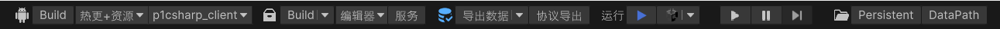


## 设置

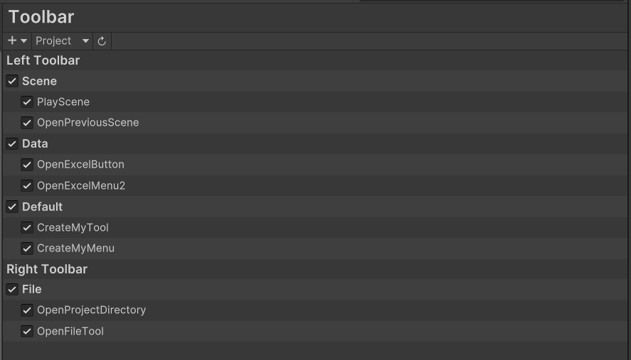

菜单打开 `Edit/Project Settings/Yanmonet/Toolbar` 设置面板

## 工具条

### 按钮样式


- 图标按钮

- 图标和文本按钮

- 图标按钮 + 菜单

- 图标和文本按钮 + 菜单


### 创建按钮

**样例**

```c#
[EditorToolbar]
static EditorToolbar PlayScene()
{
    PlayTool tool = new PlayTool();
    tool.Group = GROUP_SCENE;
    return tool;
}
```

- 包含 `EditorToolbarAttribute` 特性

- 返回创建的 `EditorToolbar` 实例


## 样例

###  运行场景

先切换到启动场景后再运行，默认`启动场景`为 `BuildSettings` 第一个

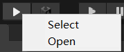

- Click

  运行启动场景

- Select

  高亮选中启动场景

- Open

  打开启动场景文件

**样例**

```c#
[EditorToolbar]
static EditorToolbar PlayScene()
{
    PlayTool tool = new PlayTool();
    tool.Group = GROUP_SCENE;
    return tool;
}
```


**设置启动场景**

- 打开设置面板

- 选择 `Scene/PlayScene`，显示 `Inspector` 面板

  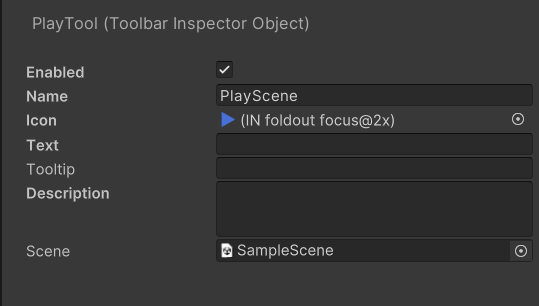

- 设置启动场景 `Scene`


### 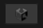 切换之前的场景

打开上一次打开的场景

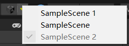

- Click

  切换到之前打开的场景

- Select

  高亮选中场景资源文件

- History List

  记录最近打开过的场景

```c#
[EditorToolbar]
static EditorToolbar SwitchPreviousScene()
{
    SwitchPreviousSceneTool tool = new SwitchPreviousSceneTool();
    tool.Group = GROUP_SCENE;
    return tool;
}
```

###   打开文件

快捷打开或跳转资源

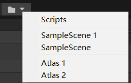


- `Scripts`

  `Ping` 高亮选中的 `Assets/Scripts` 目录

- `SampleScene 1`，`SampleScene`  ...

  打开选中的场景

- `Atlas 1`，`Atlas 2` ...

  选中图集资源

 

```c#
[EditorToolbar]
static EditorToolbar OpenFileTool()
{
    OpenFileTool tool = new OpenFileTool();
	tool.Group = EditorToolbar.GROUP_FILE;
    //显示在右侧工具条
    tool.Group.Position = ToolbarPosition.RightToolbar;
    
    tool.AddAssetFolder("Assets/Scripts",openMethod: OpenFileTool.OpenMethod.Ping)
        //菜单分割线
        .AddSeparator()
	    //包含所有场景，只在该目录查找
        .AddAssetFileFromFolder("Assets/Example/Scenes", include: ".unity$", recurve: false)
	    //包含所有图集，查找所有子文件夹
    	.AddSeparator()
        .AddAssetFileFromFolder("Assets/Atlas", include: ".spriteatlas$", recurve: true);
    return tool;
}
```


### 命令行

快捷命令行工具

**样例**

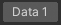

```c#
[EditorToolbar]
static EditorToolbar OpenExcelButton()
{
    CommandLineTool tool = new CommandLineTool()
    {
        Text = "Data 1",
        Group = EditorToolbar.GROUP_DATA,
    };
    //Add(string file, string argument)
    tool.Add("project://Data/Data1.xlsx");
    return tool;
}
```


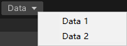

打开 Excel 数据表文件

```c#
[EditorToolbar]
static EditorToolbar OpenExcelMenu()
{
    CommandLineTool tool = new CommandLineTool()
    {
        Text = "Data",
        Tooltip = "Open Data Table",
        Group = EditorToolbar.GROUP_DATA,
    };

    //isDefault 点击工具按钮时执行的默认命令    
    tool.Add("project://Data/Data1.xlsx", name: "Data 1", isDefault: true)
        .AddSeparator()
        .Add("project://Data/Data2.xlsx", name: "Data 2");

    return tool;
}
```


## 定制工具条

### 按钮

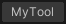

继承 `EditorToolbarButton` 类

```c#
public class MyTool : EditorToolbarButton
{
    public MyTool()
    {
        Text = "MyTool";
    }
    
    protected override void OnClick()
    {
        Debug.Log("Hello World");
    }
    
    [EditorToolbar]
    static EditorToolbar CreateMyTool()
    {
        MyTool tool = new MyTool();
        return tool;
    }
}
```

### 菜单按钮

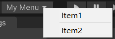

```c#
public class MyMenuTool : EditorToolbarButton
{
    [SerializeField]
    List<Item> items = new List<Item>();

    public MyMenuTool()
    {
        Text = "My Menu";
    }

    public override List<EditorToolbar.Item> GetItems()
    {
        return items.ToList<EditorToolbar.Item>();
    }

    protected override void OnCreateMenu(DropdownMenu menu)
    {
        foreach (var item in items)
        {
            if (item.IsSeparator)
            {
                menu.AppendSeparator();
                continue;
            }

            menu.AppendAction(item.Name, (o) =>
            {
                item.Execute(this);
            });
        }
    }

    [EditorToolbar]
    static EditorToolbar CreateMyMenu()
    {
        MyMenuTool tool = new MyMenuTool();
        tool.items.Add(new Item() { Name = "Item1" });
        tool.items.Add(new Item() { IsSeparator = true });
        tool.items.Add(new Item() { Name = "Item2" });

        return tool;
    }

    new class Item : EditorToolbar.Item
    {
        public void Execute(EditorToolbar tool)
        {
            Debug.Log($"MyMenuTool: {Name}");
        }
    }

}
```


