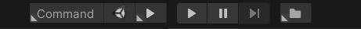

# Editor Toolbar

定制编辑器工具条


## 预览




## manifest.json

```
"com.unity.data.serialization": "https://github.com/liuwenjiexx/unity.data.serialization.git",
"com.unity.ui-elements-extension": "https://github.com/liuwenjiexx/unity.ui-elements-extension.git",
"com.unity.binding": "https://github.com/liuwenjiexx/Unity.Bindings.git?path=/Assets/Plugins/Unity.Bindings",
"com.unity.editor.toolbar": "https://github.com/liuwenjiexx/Unity.EditorToolbar.git?path=/Assets/Plugins/Unity.EditorToolbar",
```


## [详细说明](Assets/Plugins/Unity.EditorToolbar/README.md)

